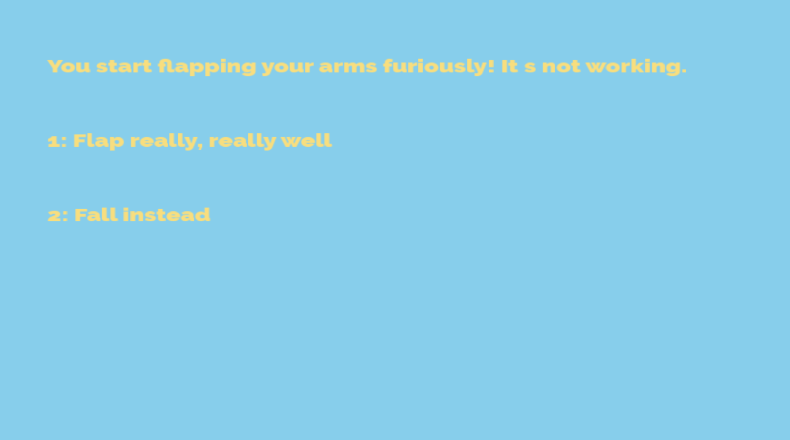

# What could go wrong

Author: Woody McCoy

Design: A game about making tough choices as you fall through the sky.

Text Drawing: Text in this game is rendered at runtime. Harfbuzz is used for shaping, Freetype for glyphs, and OpenGL for rendering those glyphs. All of this is done on demand, when the game asks for a piece of text to be written.

Screen Shot:

How To Play:

Read the current scenario, and press 1-5 to respond to it! Do your best to survive the fall.

Sources: 

https://www.fontsquirrel.com/fonts/raleway for the Raleway-Black font. See the SIL Open Font License as well.

https://github.com/ChunanGang/TextBasedGame/ for the original version of the textrenderer. Oscar's renderer was used to prototype the game,
and then used as a template for writing another font renderer.

This game was built with [NEST](NEST.md).

